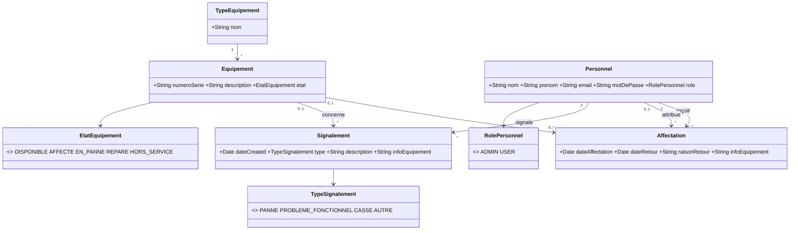

# Gestion d'Équipements — Version Micronaut

Port **Micronaut 5** de l'application Grails de gestion du parc informatique : suivi des équipements, affectations au personnel et signalements. **API REST JSON** (`/api/**`) + front statique (`/static`).

---

## Table des matières
- [Fonctionnalités](#fonctionnalités)
- [Versions](#versions)
- [Prérequis](#prérequis)
- [Démarrage rapide (15 minutes)](#démarrage-rapide-15-minutes)
- [Comptes de démonstration](#comptes-de-démonstration)
- [Diagramme des classes de domaine](#diagramme-des-classes-de-domaine)
- [Règles métier](#règles-métier)
- [Jeu de données de démonstration](#jeu-de-données-de-démonstration)
- [Tests](#tests)
- [Structure du projet](#structure-du-projet)
- [Documentation complémentaire](#documentation-complémentaire)

---

## Fonctionnalités
- **Administrateur** : `GET/POST /api/admin/equipements|personnels|affectations|signalements|audit` + écrans `static/admin/*` ; historique `/api/admin/affectations/historique` (qui a attribué quoi, à qui, quand).
- **Utilisateur** : `GET /api/app/equipements` + `POST /api/app/signalements` + restitution `POST /api/admin/affectations/{id}/retour` (ou `/api/app/...` selon rôle).
- **Inscription publique** `POST /api/auth/register` ; login `POST /api/auth/login` + session `GET /api/auth/session` (jeton CSRF).
- **Sécurité** : BCrypt, politique mdp 8car + complexité, CSRF `X-CSRF-Token`, brute-force 5/15min + quota register 3/fenêtre, en-têtes CSP/X-Frame/nosniff, cookie `HttpOnly SameSite=Lax 30m`.
- **Audit** : `AuditLog` + `GET /api/admin/audit` + `admin/audit.html`.
- **Pagination** : `max/offset` (max 100) + conservation `q`/`typeId`/`etat`.

## Versions
| Composant | Version |
|-----------|---------|
| Application | 1.0.0 |
| Micronaut | 5.0.2 (Netty, Data JPA, Validation) |
| Groovy | 4.0.32 |
| JDK | 26 (compatible 17+) |
| PostgreSQL | 17 |
| Spock | 2.x (`micronaut-test-spock`) |
| bcrypt | 0.4 (org.mindrot) |

## Prérequis
1. **JDK 26** (ou 17+) — Adoptium/Oracle.
2. **PostgreSQL 17** démarré.
3. **Git**.

## Démarrage rapide (15 minutes)

### 1. Cloner
```bash
git clone <url-micronaut>.git
cd Proj-Equipment-Micronaut
```

### 2. Créer la base
```sql
CREATE DATABASE "Equipments";
```
Schéma créé au premier démarrage (`hibernate.hbm2ddl.auto: validate` en prod, `update` si `EQUIPMENTS_DB_DDL=update`).

### 3. Variables d'environnement
| Variable | Rôle | Défaut |
|----------|------|--------|
| `EQUIPMENTS_DB_URL` | URL JDBC | `jdbc:postgresql://127.0.0.1:5432/Equipments` |
| `EQUIPMENTS_DB_USER` | user PG | `postgres` |
| `EQUIPMENTS_DB_PASSWORD` | **mot de passe PG (obligatoire)** | — |
| `PORT` | port HTTP | `8080` |
| `DEMO_ADMIN_PASSWORD` | mdp admin démo | `Admin123` |
| `DEMO_USER_PASSWORD` | mdp user démo | `User1234` |
| `EQUIPMENTS_DB_DDL` | `validate`/`update` | `validate` |
| `SECURITY_LOGIN_MAX_ATTEMPTS` etc. | seuils brute-force | 5 / 900s / 300s |

Exemples :
```bash
# Linux/macOS
export EQUIPMENTS_DB_PASSWORD=votre_mot_de_passe
# PowerShell
$env:EQUIPMENTS_DB_PASSWORD="votre_mot_de_passe"
# CMD
set EQUIPMENTS_DB_PASSWORD=votre_mot_de_passe
```

> `Admin123` / `User1234` ne servent qu'au seed de démo (si base vide). Une base existante conserve ses hash BCrypt.

### 4. Lancer
```bash
# Dev avec seed (base vide → jeu de démo inséré)
EQUIPMENTS_DB_DDL=update EQUIPMENTS_DB_PASSWORD=votre_mot_de_passe ./gradlew run

# Ou via java
./gradlew build
EQUIPMENTS_DB_PASSWORD=votre_mot_de_passe java -jar build/libs/Proj-Equipment-Micronaut-1.0.0-all.jar
```
Ouvrez `http://localhost:8080` → `index.html` (login) → `/admin/index.html` ou `/app/equipements.html`.

Le premier démarrage crée le schéma (si `update`) puis insère le jeu de démo (voir ci-dessous).

### 5. (Optionnel) Build natif / Docker
```bash
./gradlew dockerBuild   # nécessite Docker
```

## Comptes de démonstration
| Rôle | Email | Mot de passe |
|------|-------|--------------|
| Administrateur | `mamadou.diop@example.com` | `Admin123` |
| Utilisateur | `aissatou.diallo@example.com` | `User1234` |
> Surchargeables via `DEMO_ADMIN_PASSWORD` / `DEMO_USER_PASSWORD`.

## Diagramme des classes de domaine

Source PlantUML : `plantuml/class-diagram.wsd` (PNG dans même dossier).

## Règles métier
**Équipement** : créé DISPONIBLE, SN auto `SN-XXXXXXXX` si absent, SN unique, description+type obligatoires ; AFFECTE exige affectation active, DISPONIBLE/HORS_SERVICE interdits si affectation active.

**Affectation** : attribuer exige DISPONIBLE → crée `Affectation(attribuePar, dateAffectation)` + eq→AFFECTE ; déjà affecté → refus ; restitution pose `dateRetour`+`raisonRetour` → eq→DISPONIBLE ; double restitution → refus ; `dateRetour>=dateAffectation` ; déclassement clôture affectation active + `infoEquipement="...declasse"` + eq→HORS_SERVICE.

**Personnel** : email unique/validé, mdp 8car + minuscule/majuscule/chiffre, BCrypt via `@PrePersist/@PreUpdate`, `role` ADMIN/USER ; suppression bloquée si historique, auto-suppression interdite.

**Signalement** : description+type obligatoires ; seul équipement affecté à l'utilisateur courant.

**Types** : nom unique insensible casse, création via équipement uniquement.

## Jeu de données de démonstration
Créé par `BootstrapSeed.groovy` **si** `app.demo.seed=true` **et** `type_equipement` vide :
- 5 types (Ordinateur, Projecteur, Imprimante, Tablette, Téléphone) ;
- 9 équipements (DISPONIBLE/AFFECTE/EN_PANNE/REPARE) ;
- 7 personnels (2 ADMIN, 5 USER) ;
- 2 affectations (`attribuePar` renseigné) + 2 signalements.
Mots de passe via `app.demo.adminPassword` / `userPassword` (env).

## Tests
Spock 45 tests (8 suites) : contraintes (`ValidationMessagesService`), services `AffectationService` (attribution, restitution, desaffecter, déclasser + cas d'erreur), `LoginAttemptService`, `AuditService`, intégration parcours complet.
```bash
# Tous les tests (nécessite PG + mot de passe)
EQUIPMENTS_DB_PASSWORD=votre_mot_de_passe ./gradlew test

# Un test
EQUIPMENTS_DB_PASSWORD=votre_mot_de_passe ./gradlew test --tests "*AffectationServiceSpec*"
```
Résultat attendu : **45 tests, 0 échec**.

## Structure du projet
```
Proj-Equipment-Micronaut/
├── src/main/groovy/proj/equipment/
│   ├── controller/  # Admin* (REST /api/admin), App* (/api/app), AuthController, HttpUtil
│   ├── domain/      # Equipement, Personnel, Affectation (+attribuePar), Signalement, TypeEquipement, AuditLog, enums
│   ├── dto/         # ApiModels
│   ├── filter/      # AuthFilter, CsrfFilter, SecurityHeadersFilter
│   └── service/     # AffectationService, ValidationMessagesService, BootstrapSeed, CatalogService, AuditService, ...
├── src/main/resources/
│   ├── application.yml
│   └── static/      # admin/*, app/*, js/api.js (groupCollapsed, sanitize ***), js/ui.js (submitGuard)
├── src/test/groovy/proj/equipment/ # 8 Spock specs (45 tests)
├── cahiers-de-recette/ # recette-v1.md (Grails), recette-v2.md (Micronaut, 42 scénarios OK)
├── plantuml/class-diagram.wsd
└── build.gradle
```

## Documentation complémentaire
- `LIMITES_CONNUES.md` — limites restantes.
- `cahiers-de-recette/recette-v2.md` — PV de recette Micronaut (42 scénarios).

---
**Dépôt propre** : aucun secret committé (`password: ${EQUIPMENTS_DB_PASSWORD}`), commits en français, seed via `BootstrapSeed` uniquement si base vide.
