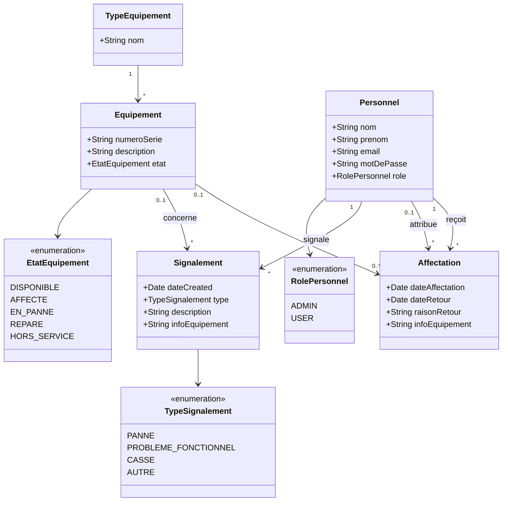

# Gestion d'Équipements

Application web de gestion du parc informatique : suivi des équipements, de leurs
affectations au personnel et des signalements de problèmes.

Développée avec **Grails 7**, **Groovy**, **Spring Boot 3** et **PostgreSQL**.

---

## Table des matières

- [Fonctionnalités](#fonctionnalités)
- [Versions](#versions)
- [Prérequis](#prérequis)
- [Démarrage rapide (15 minutes)](#démarrage-rapide-15-minutes)
- [Comptes de démonstration](#comptes-de-démonstration)
- [Diagramme des classes de domaine](#diagramme-des-classes-de-domaine)
- [Règles métier](#règles-métier)
- [Jeu de données de démonstration](#jeu-de-données-de-démonstration)
- [Tests](#tests)
- [Structure du projet](#structure-du-projet)
- [Documentation complémentaire](#documentation-complémentaire)

---

## Fonctionnalités

- **Administrateur** (`/admin`) : gestion des équipements, du personnel, des
  affectations et des signalements ; consultation de l'historique des attributions.
- **Utilisateur** (`/app`) : consulter ses équipements affectés, signaler un
  problème, restituer un équipement.
- **Inscription publique** pour les utilisateurs (l'admin crée les comptes
  administrateurs).
- **Sécurité** : contrôle d'accès par rôle, mots de passe hachés (BCrypt),
  validation renforcée des saisies.

## Versions

| Composant | Version |
|-----------|---------|
| Grails | 7.2.1 (wrapper fourni, pas d'installation globale requise) |
| Groovy | 4.0.32 |
| Spring Boot | 3.5.16 |
| Spring | 6.2.19 |
| JDK | 26 (Oracle / compatible 17+) |
| PostgreSQL | 17 |
| Spock (tests) | 2.x (fourni par le BOM Grails) |
| bcrypt (org.mindrot) | 0.4 |

## Prérequis

1. **JDK 26** (ou 17+) — [Adoptium](https://adoptium.net/) ou Oracle.
2. **PostgreSQL 17** démarré en local.
3. **Git** pour cloner le dépôt.
4. **Node.js 20+** et **npm** (uniquement pour la compilation des assets
   Tailwind ; le build les produit automatiquement).

## Démarrage rapide (15 minutes)

### 1. Cloner le dépôt

```bash
git clone https://github.com/AABSmog/projet-equipements.git
cd projet-equipements
```

### 2. Créer la base de données

```sql
CREATE DATABASE "Equipments";
```

Le schéma et les tables sont créés automatiquement au premier démarrage
(`dbCreate: update`) ; aucun script SQL manuel n'est nécessaire.

### 3. Configurer les variables d'environnement

La base de données et les comptes de démonstration sont configurés par
variables d'environnement (aucun secret n'est commité).

| Variable | Rôle | Valeur par défaut |
|----------|------|-------------------|
| `EQUIPMENTS_DB_URL` | URL JDBC de la base | `jdbc:postgresql://localhost:5432/Equipments` |
| `EQUIPMENTS_DB_USER` | Utilisateur PostgreSQL | `postgres` |
| `EQUIPMENTS_DB_PASSWORD` | **Mot de passe PostgreSQL (obligatoire)** | — |
| `DEMO_ADMIN_PASSWORD` | Mot de passe des comptes admin de démo | `admin123` |
| `DEMO_USER_PASSWORD` | Mot de passe des comptes user de démo | `pass123` |

Exemples (adaptez le mot de passe PostgreSQL à votre installation) :

<details>
<summary>Windows — CMD</summary>

```bat
set EQUIPMENTS_DB_PASSWORD=votre_mot_de_passe
```

</details>

<details>
<summary>Windows — PowerShell</summary>

```powershell
$env:EQUIPMENTS_DB_PASSWORD = "votre_mot_de_passe"
```

</details>

<details>
<summary>macOS / Linux</summary>

```bash
export EQUIPMENTS_DB_PASSWORD=votre_mot_de_passe
```

</details>

> Les valeurs par défaut `admin123` / `pass123` ne s'appliquent qu'au jeu de
> données de démonstration, en environnement de développement uniquement.

### 4. Lancer l'application

```bash
# Windows
grailsw.bat run-app -port=18080

# macOS / Linux
./grailsw run-app -port=18080
```

Ouvrez ensuite <http://localhost:18080>.

Le premier démarrage crée le schéma puis insère le jeu de données de
démonstration (voir [plus bas](#jeu-de-données-de-démonstration)).

### 5. (Optionnel) Construire le WAR de production

```bash
grailsw.bat war
```

## Comptes de démonstration

| Rôle | Email | Mot de passe |
|------|-------|--------------|
| Administrateur | `mamadou.diop@example.com` | `admin123` |
| Utilisateur | `aissatou.diallo@example.com` | `pass123` |

> Identifiants de démonstration uniquement, surchargeables via les variables
> `DEMO_ADMIN_PASSWORD` / `DEMO_USER_PASSWORD`.

## Diagramme des classes de domaine



Une version PlantUML est également disponible dans
[`plantuml/class-diagram.wsd`](plantuml/class-diagram.wsd) (avec les PNG générés
dans le même dossier). Pour régénérer les images :

```bash
plantuml plantuml/class-diagram.wsd
```

## Règles métier

**Équipement**

- Un équipement est créé à l'état **Disponible** ; si aucun numéro de série
  n'est saisi, un SN unique est généré automatiquement (`SN-XXXXXXXX`).
- Le numéro de série est unique ; la description et le type sont obligatoires.
- Un équipement ne peut pas être marqué **Affecté** sans affectation active,
  ni rendu **Disponible** ou classé **Hors service** tant qu'une affectation
  active existe.

**Affectation / attribution**

- L'attribution d'un équipement exige qu'il soit **Disponible** ; elle crée une
  affectation (date, auteur `attribuePar`) et passe l'équipement à **Affecté**.
- Un équipement déjà affecté ne peut pas être réattribué (ni au même personnel,
  ni à un autre).
- La restitution enregistre la date et la raison du retour puis repasse
  l'équipement à **Disponible** ; une affectation déjà clôturée ne peut pas
  être restituée une seconde fois.
- La date de retour ne peut pas être antérieure à la date d'affectation.
- Le déclassement clôture l'affectation active (si elle existe) et passe
  l'équipement à **Hors service**.

**Personnel**

- Le mot de passe est obligatoire (6 caractères minimum) et haché en BCrypt
  (`beforeInsert` / `beforeUpdate`).
- L'email est obligatoire, unique et valide.
- Un personnel ayant un historique (affectations ou signalements) ne peut pas
  être supprimé ; un administrateur ne peut pas supprimer son propre compte.

**Signalement**

- La description et le type de problème sont obligatoires.
- Un signalement ne peut être créé que sur un équipement actuellement affecté
  à l'utilisateur connecté.

**Types d'équipement**

- Le nom est obligatoire et unique, insensible à la casse (« Scanner » et
  « scanner » sont considérés identiques).
- Les types se créent via l'option « Autre... » du formulaire d'équipement ;
  leur création/modification/suppression directe est désactivée.

## Jeu de données de démonstration

Le jeu de données est créé par [`BootStrap.groovy`](grails-app/init/proj/equipment/BootStrap.groovy)
**uniquement en environnement de développement** et **uniquement si la base est
vide** (`TypeEquipement.count() == 0`) :

- 5 types (Ordinateur, Projecteur, Imprimante, Tablette, Téléphone) ;
- 9 équipements (états variés : Disponible, Affecté, En panne, Réparé) ;
- 7 personnels (2 administrateurs, 5 utilisateurs) ;
- 2 affectations et 2 signalements.

Les mots de passe proviennent de la configuration (`demo.adminPassword` /
`demo.userPassword`), surchargeables par variables d'environnement.

## Tests

La suite Spock couvre les contraintes de domaine, le service d'attribution
(`AffectationService`) et un parcours complet d'intégration.

```bash
# Tous les tests (unitaires + intégration)
grailsw.bat test-app

# Uniquement les tests unitaires
grailsw.bat test
```

Résultat attendu : **35 tests, 0 échec**.

## Structure du projet

```
Proj-Equipment/
├── grails-app/
│   ├── conf/          # application.yml (base, démo)
│   ├── controllers/   # AdminController, app/*, admin/*
│   ├── domain/        # Equipement, Personnel, Affectation, Signalement, TypeEquipement, enums
│   ├── init/          # BootStrap (jeu de données de démo)
│   ├── services/      # AffectationService, ValidationMessagesService
│   └── views/         # GSP (layouts admin/app, écrans)
├── plantuml/          # Diagrammes (classes, séquences, use case)
├── src/test/          # Tests Spock unitaires
├── src/integration-test/ # Tests Spock d'intégration
├── cahiers-de-recette/   # Procès-verbaux de recette (v1, suivi des anomalies)
└── build.gradle
```

## Documentation complémentaire

- [`LIMITES_CONNUES.md`](LIMITES_CONNUES.md) — limites et anomalies restantes
  non traitées.
- [`cahiers-de-recette/recette-v1.md`](cahiers-de-recette/recette-v1.md) —
  procès-verbal de la recette v1 (28 scénarios) et suivi des anomalies.

---

**Dépôt propre** : aucun mot de passe ou secret n'est committé ; les identifiants
d'accès se configurent par variables d'environnement. Les commits sont en
français et documentés. Le jeu de données de démonstration est porté par
`BootStrap.groovy` (développement uniquement).
