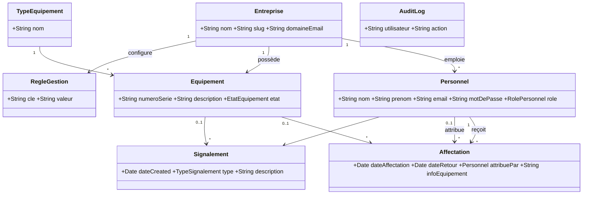

# Gestion d'Équipements — Version Micronaut (Entreprise)

Port **Micronaut 5** de l'application Grails : suivi du parc par **Entreprise** (ex-Établissement), équipements, affectations, signalements. **API REST JSON** (`/api/**`) + front statique.

## Versions
| Composant | Version |
|-----------|---------|
| App | 1.0.0 |
| Micronaut | 5.0.2 |
| Groovy | 4.0.32 |
| JDK | 26 (17+) |
| PostgreSQL | 17 |
| Spock | 2.x |
| bcrypt | 0.4 |

## Prérequis
JDK 26, PostgreSQL 17, Git.

## Démarrage rapide — 15 minutes

**1. Cloner**
```bash
git clone <url>.git
cd Proj-Equipment-Micronaut
```

**2. Base**
```sql
CREATE DATABASE "Equipments";
```

**3. Variables**
| Variable | Défaut | Note |
|----------|--------|------|
| `EQUIPMENTS_DB_PASSWORD` | — | **obligatoire** PG |
| `EQUIPMENTS_DB_URL` | `jdbc:postgresql://127.0.0.1:5432/Equipments` | |
| `DEMO_ADMIN_PASSWORD` / `DEMO_USER_PASSWORD` | `Assane10!` | seed si base vide |
| `PORT` | `8080` | |
| `EQUIPMENTS_DB_DDL` | `validate` (prod) / `update` (dev) | |

```bash
# PowerShell
$env:EQUIPMENTS_DB_PASSWORD="Smogolem10!"
$env:DEMO_ADMIN_PASSWORD="Assane10!"
# CMD
set EQUIPMENTS_DB_PASSWORD=Smogolem10!
```

**4. Lancer**
```bash
EQUIPMENTS_DB_DDL=update EQUIPMENTS_DB_PASSWORD=Smogolem10! ./gradlew run
# → http://localhost:8080
# Login : choisis une Entreprise, ex: admin@testfinal.com / AdminFinal2024! (voir USERS_MOTS_DE_PASSE.txt)
```

**5. Vérifier**
```bash
curl http://localhost:8080/api/etablissements # liste entreprises
curl http://localhost:8080/api/meta
EQUIPMENTS_DB_PASSWORD=Smogolem10! ./gradlew test # 45 tests
```

## Comptes de démonstration
Tous les mots de passe uniformisés au boot (`BootstrapSeed.groovy:61` → `USERS_MOTS_DE_PASSE.txt`).

| Entreprise | Email | Mot de passe | Rôle |
|------------|-------|--------------|------|
| principal | `mamadou.diop@example.com` | `Mamadou2024!` | ADMIN |
| principal | `fatou.ndiaye@example.com` | `Fatou2025#` | ADMIN |
| principal | `aissatou.diallo@example.com` | `Aissatou24$` | USER |
| test-final | `admin@testfinal.com` | `AdminFinal2024!` | ADMIN |
| etab-test-iso | `admin@etabtest.com` | `AdminEtab2025!` | ADMIN |
| somdop (nouvelle base) | `m.diop@somdop.com` | `SomdopM2024!` | ADMIN |

> Liste complète `USERS_MOTS_DE_PASSE.txt` (31 comptes). Sur nouvelle base, `somdop`/`coulibaly-industries` créés avec 6 équipements chacun.

## Diagramme des classes


## Règles métier
- **Equipement** : créé `DISPONIBLE`, SN auto `SN-…` unique insensible casse, `AFFECTE` exige affectation active, `HORS_SERVICE` clôture + `infoEquipement`.
- **Affectation** : `DISPONIBLE` → `AFFECTE` + `attribuePar` (historique), déjà affecté / `EN_PANNE` refusé, `desaffecter` → `DISPONIBLE`, `declasser` → `HORS_SERVICE`, `dateRetour>=dateAffectation`, double restitution refusée.
- **Personnel** : email unique/validé, mdp 8+ complexité BCrypt, dernier ADMIN protégé, suppression bloquée si historique.
- **Signalement** : type+description obligatoires, seul équipement affecté.
- **Entreprise** : `etablissement_id` isole tout (`TenantFilter` → `TenantContext`), `RegleGestion` par entreprise (`/admin/regles.html`), wizard 4 étapes `POST /api/etablissements/wizard` et `/api/admin/etablissements/wizard`.

## Jeu de données
`BootstrapSeed.groovy:37` si `app.demo.seed=true` et base vide → 2 entreprises démo + `assurerEquipementsPourTous()` (6/entreprise si <5) + uniformisation mdp réalistes. Sinon `assurerEquipementsPourTous` garantit quand même des équipements.

## Tests
```bash
EQUIPMENTS_DB_PASSWORD=Smogolem10! ./gradlew test
# 45 tests Spock (8 suites : PersonnelSpec, EquipementSpec, AffectationSpec, TypeEquipementSpec, AffectationServiceSpec 12, AuditServiceSpec, LoginAttemptServiceSpec, ParcoursCompletIntegrationSpec)
```

## Structure
```
controller/ # Admin*, App*, Auth, PublicEtablissement
domain/ # Entreprise(Etablissement), Equipement, Affectation(attribuePar), Personnel, Signalement, RegleGestion
service/ # AffectationService, BootstrapSeed, CatalogService, TenantContext
static/ # admin/*, app/*, js/pages/*, index.html (entreprise)
cahiers-de-recette/ # recette-v3 (20 scénarios), v2 (42)
```

## Historique des attributions
`Affectation.attribuePar` (`Affectation.groovy:25`) + `dateAffectation/dateRetour` → `GET /api/admin/affectations/historique` (`AdminAffectationController.groovy:34`, `CatalogService.groovy:79` `order by dateAffectation desc`, `join fetch attribuePar`) → `admin/affectation-historique.html` colonnes *Équipement, N° Série, Attribué à/par, Dates, Raison, Statut*.

## Documentation
- `API_GUIDE.md` — tous les endpoints
- `LIMITES_CONNUES.md`
- `USERS_MOTS_DE_PASSE.txt`
- `cahiers-de-recette/recette-micronaut-v3.md`
